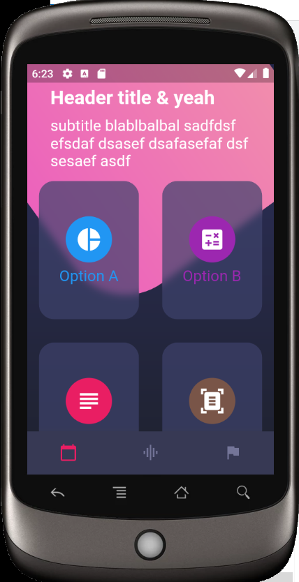
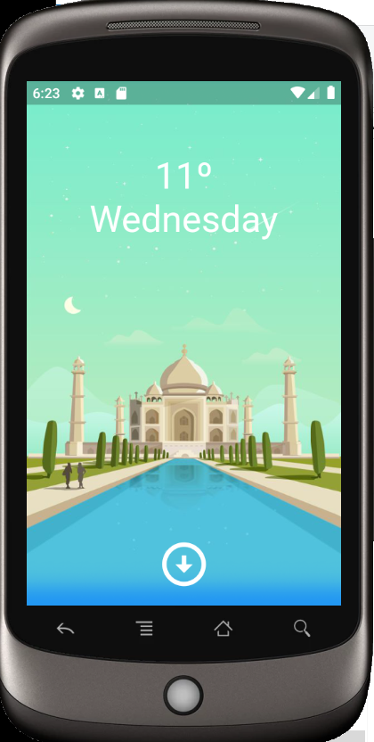

# flutter_design_practice_1

Just a practice about design in Flutter concernig Scaffold, colums, rows, margin, styles, etc..

Design 1: about colums, rows, expanded, sizedBoxes...

Design 2: about scroll and pageviews

Design 3: about stack, tables, tablerows, linearGradients, blur effects

From the Fernando Herrera couse at udemy.com

## Getting Started

This project is a starting point for a Flutter application.

A few resources to get you started if this is your first Flutter project:

- [Lab: Write your first Flutter app](https://docs.flutter.dev/get-started/codelab)
- [Cookbook: Useful Flutter samples](https://docs.flutter.dev/cookbook)

For help getting started with Flutter development, view the
[online documentation](https://docs.flutter.dev/), which offers tutorials,
samples, guidance on mobile development, and a full API reference.
